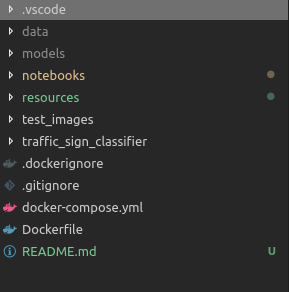
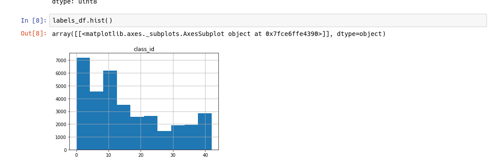
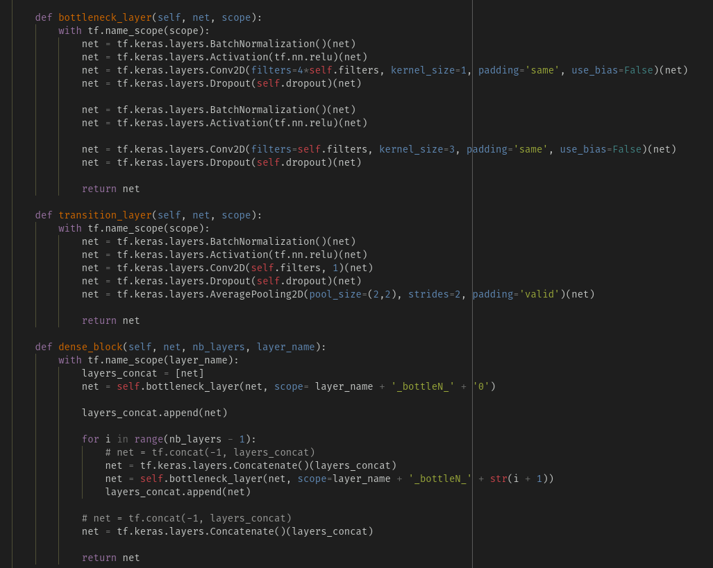
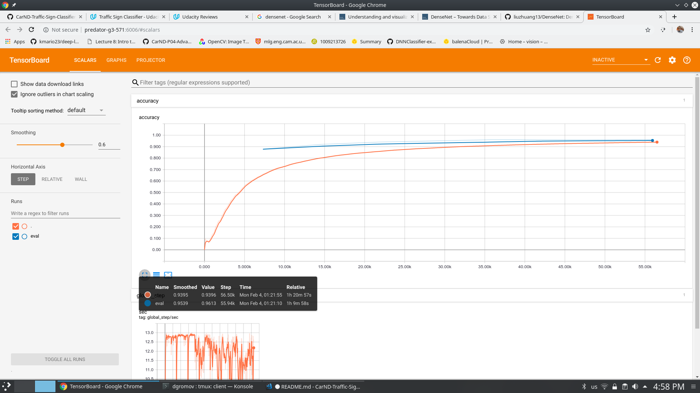
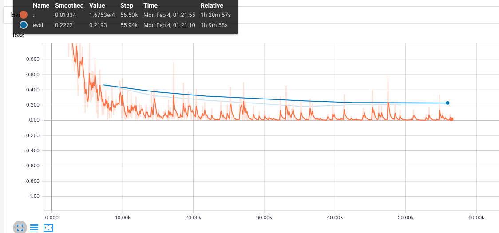
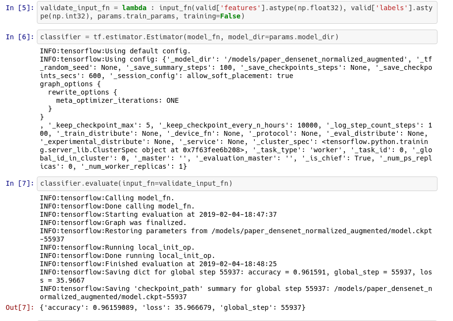
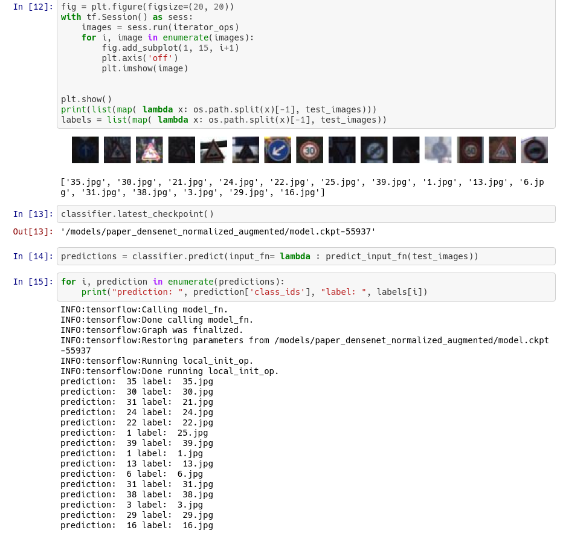

# German Traffic Sign Classifier.

In this repository we try to solve the problem of training a deep learning model to learn representations to figure out classify german traffic signs.

Most of the discussion done here can be obtained at a glance on the following:

[Jupyter Notebooks](./notebooks)

It is important to to observe the following notebooks:

[Data Exploration](./notebooks/data_exploration.ipynb)

This notebook contains the explorations done to the provided German Traffic Dataset provided by Udacity, we also use the notebook to explore how to use the `tf.data` API.

[Model Accuracy](./notebooks/model_accuracy.ipynb)

In this notebook we take our previously trained model in `/models` (Link to download pretrained models here: [model link](https://drive.google.com/open?id=1tXY47zHgXO9lQKqAExqjN8sfiGIZlOdL)
) and observe the validation score obtained in the validation dataset and make inference in both validation data and unexplored data.

[Validation Exploration](./notebooks/validation_exploration.ipynb)

In this notebook we explore in which cases the model makes a mistake and compute again the validation score manually.

## Training and Data Pipelines using tf.estimator and tf.data

You should a `data` folder that contains:

* `test.p`
* `train.p`
* `valid.p`


This repository consists of a `Dockerfile` and `docker-compose.yml` that contains all the dependencies and services for notebook visualization and training.

Do not forget to build the services for the first time:

(all the commands have root directory in the root of the repository)

```
$ docker-compose build
```

### Notebook service for data exploration and model validation

```bash
$ docker-compose up notebook
```

### Notebook for training:

```bash
$ docker-compose up train
```

### Interactive ipython-shell service

```bash
$ docker-compose up ipython-shell
```


All the code for training and testing is contained in a package called [traffic_sign_classifier](./traffic_sign_classifier)

The tree structure of the module consists of:

[german_traffic_dataset.py](./traffic_sign_classifier/german_traffic_dataset.py):
Which is the module that contains the data pipelines and data augmentation

[german_traffic_densenet.py](./traffic_sign_classifier/german_traffic_densenet.py):
Which is the module that contains the model function for the densenet architecure and their parameters.

[german_traffic_main_densenet.py](./traffic_sign_classifier/german_traffic_main_densenet.py):
Module that contains the main loop for training.

[configs.yml](./traffic_sign_classifier/configs.yml)
Config file that contains the main hyperparameters for training. They can be overrided by command line arguments. But is preferable to use just modify the configs.yml

After training or you can download the models from here:

[model link](https://drive.google.com/open?id=1tXY47zHgXO9lQKqAExqjN8sfiGIZlOdL)

The structure should have a folder model and a data folder such as:




## Dataset Exploration

Before deciding the architecture we make a exploration of the dataset.

As we can see:


Our training dataset consists of 347999 elements for training, is a good dataset, but:



it is completly imbalanced so this suggest in adding data augmentation on our data pipelines. This is done in lines 17 to 31 in `german_traffic_dataset.py`

```python
def train_preprocess(image, label):

    if label in [11, 12, 13, 15, 17, 18, 22, 26, 30, 35]:
            image = tf.image.random_flip_left_right(image)

    if label in [1, 5, 12, 15, 17]:
        image = tf.image.random_flip_up_down(image)

    image = tf.image.random_brightness(image, max_delta=32.0 / 255.0)
    image = tf.image.random_saturation(image, lower=0.5, upper=1.5)

    # Make sure the image is still in [0, 1]
    image = tf.clip_by_value(image, 0.0, 1.0)

    return image, label

```

We artifically make some random augmentations in certain classes.

The visualization is done in :


[Data Exploration notebook](./notebooks/data_exploration.ipynb)


### Design and test a model Architecture

The preprocessing stages and the data augmentation are in the german_traffic_dataset.py the preprocessing consists of:

* Reading the pickle file
* Converting our data into the dataset API Lines:

```python
def input_fn(images, labels, params, training):
    
    ds = tf.data.Dataset.from_tensor_slices((
        images,
        labels,
    ))

    ds = ds.map(parse_function, num_parallel_calls=4)
    
    if training:
        ds = ds.map(train_preprocess, num_parallel_calls=4)
        ds = ds.apply(tf.data.experimental.shuffle_and_repeat( 
        buffer_size = params.buffer_size,
        count = params.epochs,
        ))
        
    #ds  ds.map(lambda x, y: ({"images": x}, y))

    # ds = ds.map(lambda x, y: (tf.cast(x, tf.float32), tf.cast(y, tf.int32)))
        
    ds = ds.batch(params.batch_size, drop_remainder=True)
    ds = ds.prefetch(buffer_size=2)

    
    return ds
```

* Perform some random augmentation (see above)

Now that we have our dataset input_fn and trainig data as a `tf.data.Dataset`

we can iterate over our model architecture.

### Model Architecture

We decide for this problem implement the DenseNet architecture:


Using tensorboard we can see the graph representation of the DenseNet class definded in [german_traffic_densenet.py](./traffic_sign_classifier/german_traffic_densenet.py):


We follow the paper closely by defining the blocks:



In a more high level we follow:


### Model Training:

We use `tf.AdamOptimizer(0.0001)` with a initial learning rate of 0.0001. We trained for 300 epochs. And resulting in the following loss graphs:



We observe that we achive a 96% training and a 95% accuracy on the train and eval datasets respectively.

Also our loss seems to indicate that we could have gone with a better model and more accuracy if we had trained for more steps:



### Solution Approach.

As seen in our notebooks

[Model Accuracy](./notebooks/model_accuracy.ipynb) and [Validation Exploration](./notebooks/validation_exploration.ipynb)

Using the validation set: 



On a more manual observation we observe that, in the validation set we make a mistake often with images of the first class:.

See [Validation Exploration](./notebooks/validation_exploration.ipynb)

### Test a Model on New Images

We made inference on new images that are located in the [folder test_images](./test_images)

We make inference on **validation images** that were never seen either in evaluation or training, and **web images**.

More info in the Jupyter Notebook [Model Accuracy](./notebooks/model_accuracy.ipynb)


**Validation images**




We see that we make two mistakes, which I think is pretty good.

**External Web Images**

 Now we take external images from the web and make inference.

 

So we see that in the case that we make one mistake, the network have a certain distribution to the correct class I think that we should let train the model for a few more epochs.


